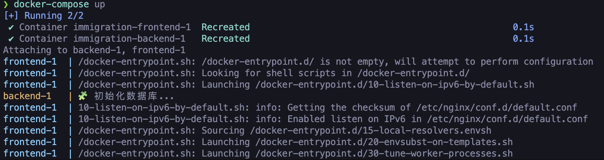
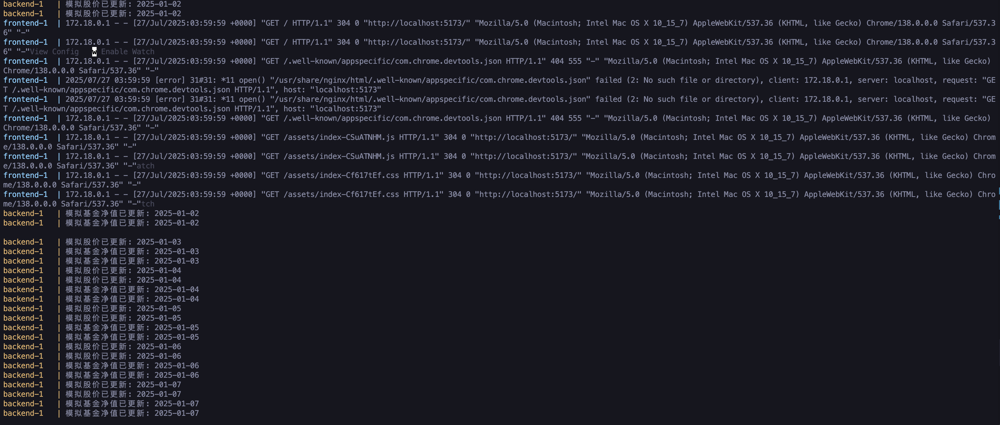
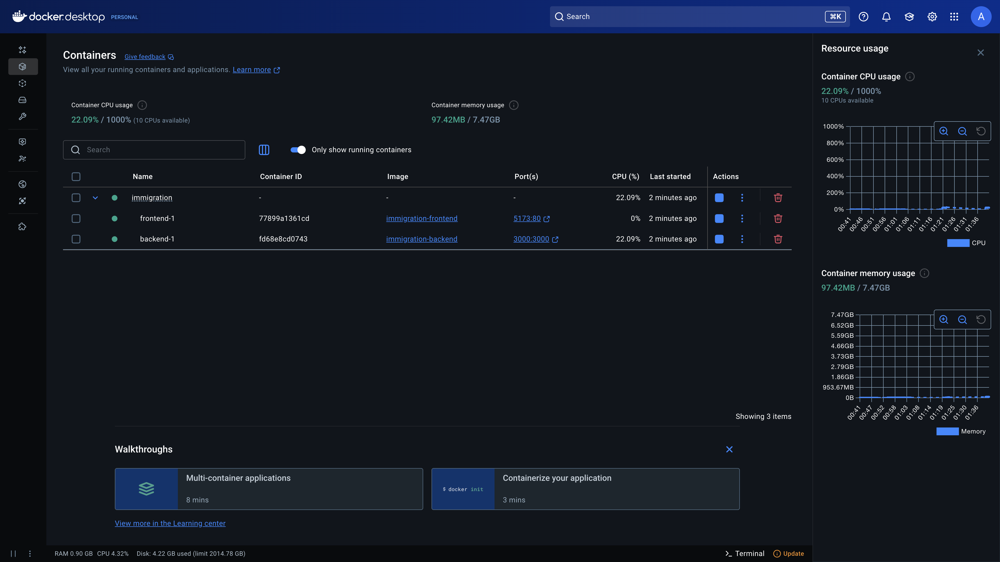
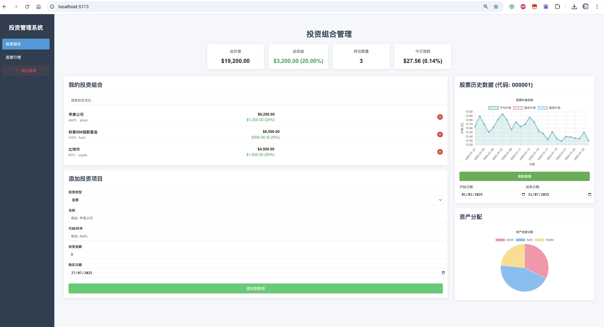
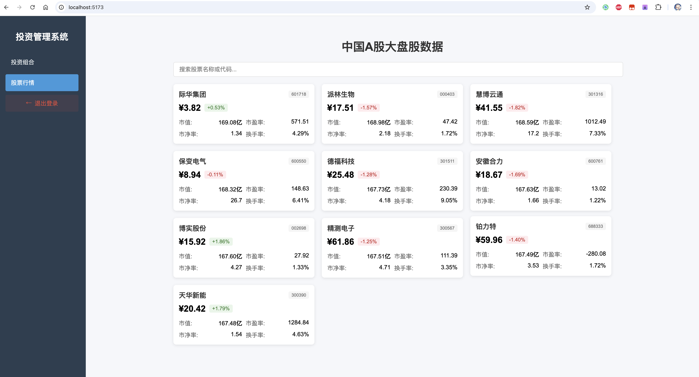

# Crazy Friday -- Portfoilo Manager Application

>This is a `Portfoilo Manager Application` developed by `Crazy Friday`. The application is designed to help users manage their portfolios effectively.

## 🌈Team Members

- 🥸`Member 1`: `Allen Zhang`
- 🤯`Member 2`: `Shailin Xia`
- 🥳`Member 3`: `Kelly Suo`
- 😎`Member 4`: `Tom He`
- 🙃`Member 5`: `Alfred Lu`

## 🛠Tech Stack

```text
- Frontend: Vue.js, Vite, Axios, ECharts
- Backend: Node.js, Express, SQLite, Axios
- Database: SQLite
- Docker: Docker Compose
- Other: Postman for API testing
```

## 📖Features

## 🎬Project Structure

```text
.
├── backend
│   ├── app.js
│   ├── config
│   │   └── db.js
│   ├── data
│   │   ├── fund.xlsx
│   │   └── stock.xlsx
│   ├── db
│   │   └── dummy.db
│   ├── Dockerfile.backend
│   ├── package-lock.json
│   ├── package.json
│   ├── postman
│   │   ├── apiTest.json
│   │   └── postman_collection.json
│   ├── README.md
│   ├── routes
│   │   ├── funds.js
│   │   ├── stocks.js
│   │   └── userInfo.js
│   ├── scripts
│   │   └── initDB.js
│   ├── start.sh
│   └── utils
│       ├── fundSimulator.js
│       ├── importXlsx.js
│       └── priceSimulator.js
├── docker-compose.yml
├── frontend
│   ├── Dockerfile.frontend
│   ├── index.html
│   ├── package-lock.json
│   ├── package.json
│   ├── public
│   │   ├── favicon.ico
│   │   └── vite.svg
│   ├── README.md
│   ├── src
│   │   ├── App.vue
│   │   ├── assets
│   │   │   ├── base.css
│   │   │   ├── extensions.json
│   │   │   ├── logo.svg
│   │   │   ├── main.css
│   │   │   └── vue.svg
│   │   ├── components
│   │   │   ├── HelloWorld.vue
│   │   │   ├── PortfolioManager.vue
│   │   │   └── StockList.vue
│   │   ├── main.js
│   │   ├── router
│   │   │   └── index.js
│   │   └── views
│   │       └── LoginView.vue
│   └── vite.config.js
├── log
│   ├── data.log
│   ├── server.log
│   └── vue.log
├── package-lock.json
├── package.json
├── README.md
├── start.sh
├── stop.sh
└── structure.txt

17 directories, 49 files
```

## 🤪Prerequisites

> - Node.js Reference version: `v20.19.4`
> - npm (Node Package Manager)

```bash
>>>>>>> Allen
# Installation Instructions

# 1. Convert to the project directory

cd Portfoilo-Manager-Team-7


npm install express cors axios
>>>>>>> Allen

# 2. And then `cd frontend`

npm install 

npm install axios 


# 3. Finally, `cd ../backend`

npm install express better-sqlite3 xlsx

```

> If your environment version is not the same as the reference version, maybe you need to rebuild the `better-sqlite3` package

## 🚀Usage

```bash
# Set up the terminal authentication in the project root directory

MacOS/Linux:
chmod +x start.sh

Windows: 
Please use git bash to run the script
chmod +x start.sh

MacOS/Linux:
chmod +x stop.sh

Windows: 
Please use git bash to run the script
chmod +x stop.sh

# Start the whole server
./start.sh

# Stop the whole server
./stop.sh
```

## :whale: Docker 

### Install Docker in Mac

```bash
brew install --cask docker

brew install docker-compose
```

> Start Docker Desktop and wait for it to initialize.
> And then conduct the following commands in the terminal.

```bash
docker-compose build

docker-compose up
```
> The run status will be shown in the terminal.
> 
> 

> Docker pages will be created in the `frontend` and `backend` directories.
> 

> If you build the docker image successfully, you can access the frontend application at `http://localhost:5173` and the backend API at `http://localhost:3000/`.

> 
> 

## 🤜Acknowledgements🤛
>>>>>>> Allen
